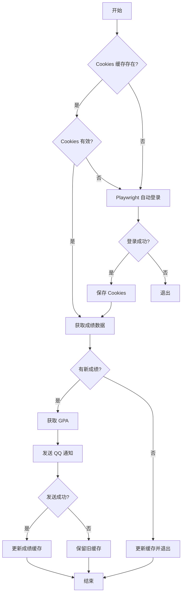

# NUIST 成绩更新通知

<div align="center">


</div>

本项目用于自动查询 NUIST 教务系统的成绩更新，并通过 OneBot 协议发送 QQ 通知。支持多用户配置、Cookies 缓存、GPA 自动获取、WebVPN 模式等功能。

## 适用范围

理论上适用于所有使用**金智教务系统**的高校，但目前仅在 **南京信息工程大学 (NUIST)** 进行过测试。

## ✨ 功能特性

- 🔐 **自动登录** - 使用 Playwright 自动化登录，支持验证码自动识别
- 🍪 **Cookies 缓存** - 缓存登录状态，减少登录频率
- 📊 **成绩检测** - 自动检测新增成绩，避免重复通知
- 📈 **GPA 获取** - 自动获取最新 GPA 并随通知发送
- 📱 **QQ 通知** - 通过 OneBot 协议发送私聊消息
- 👥 **多用户支持** - 支持配置多个用户账号
- 🌐 **WebVPN 支持** - 支持通过学校 WebVPN 访问教务系统

## 📁 项目结构

```
cjcx/
├── main.py              # 主程序入口（成绩查询 + 通知）
├── NuistLogin.py        # 登录模块（可独立使用）
├── requirements.txt     # 依赖清单
├── nuist_cookies.json   # NUIST 登录 Cookies 缓存（自动生成）
├── vpn_cookies.json     # VPN Cookies 文件（VPN 模式需要）
└── README.md            # 项目说明
```

## 🚀 快速开始

### 环境要求

- Python 3.8+
- OneBot 实现（如 [Lagrange.OneBot](https://github.com/LagrangeDev/Lagrange.Core)、[NapCat](https://github.com/NapNeko/NapCatQQ) 等）

### 安装依赖

```bash
# 安装 Python 依赖
pip install -r requirements.txt

# 安装 Playwright 浏览器
playwright install chromium
```

### 使用方法

#### 单次运行

```bash
python main.py -u <学号> -p <Passkey JSON> -qq <QQ号>
```

#### 完整参数

```bash
python main.py -u <学号> -p <Passkey JSON> -qq <QQ号> [--webhook <OneBot地址>] [--multi] [--vpn]
```

| 参数 | 必填 | 说明 | 默认值 |
|------|------|------|--------|
| `-u, --user` | ✅ | CAS系统学号 | - |
| `-p, --password` | ✅ | CAS系统Passkey JSON | - |
| `-qq, --qq` | ✅ | 接收通知的 QQ 号 | - |
| `--webhook` | ❌ | OneBot HTTP API 地址 | `http://127.0.0.1:3000/send_private_msg` |
| `--multi` | ❌ | 多用户模式（通知中显示学号） | `False` |
| `--vpn` | ❌ | 使用 WebVPN 模式访问教务系统 | `False` |
| `--vpn-cookies` | ❌ | VPN Cookies 文件路径 | `./vpn_cookies.json` |

#### WebVPN 模式

当无法直接访问校园网时，可以使用 WebVPN 模式：

```bash
python main.py -u <学号> -p <Passkey JSON> -qq <QQ号> --vpn
```

> ⚠️ **注意**：使用 VPN 模式前，需要先准备 `vpn_cookies.json` 文件。可以使用 `NuistLogin.py` 工具生成（详见下方独立使用说明）。

#### 定时任务配置

**Linux (crontab)**
```bash
# 每 30 分钟检查一次
*/30 * * * * cd /path/to/cjcx && python main.py -u 学号 -p Passkey JSON -qq QQ号
```

**Windows (任务计划程序)**
1. 打开「任务计划程序」
2. 创建基本任务，设置触发器为每 30 分钟
3. 操作选择「启动程序」，填入 Python 和脚本路径

## 📝 通知示例

```
📢 成绩更新通知

📚 高等数学
   成绩: 0 | 学分: 0.0 | 绩点: 0.0
   学期: 2025-2026-1学期

📚 大学物理
   成绩: 0 | 学分: 0.0 | 绩点: 0.0
   学期: 2025-2026-1学期

📊 当前 GPA: 0.000
```

## 🔧 NuistLogin 独立使用

`NuistLogin.py` 是一个独立的登录模块，可以单独使用来获取 NUIST 统一身份认证的 Cookies。

### 命令行使用

```bash
# 基本用法（登录并保存 Cookies）
python NuistLogin.py <学号> <Passkey JSON>

# 使用 VPN 模式
python NuistLogin.py <学号> <Passkey JSON> --vpn

# 显示浏览器窗口（调试用）
python NuistLogin.py <学号> <Passkey JSON> --no-headless

# 完整参数
python NuistLogin.py <学号> <Passkey JSON> [--vpn] [--no-headless] [--verbose]
```

| 参数 | 说明 |
|------|------|
| `学号` | NUIST 学号（必填） |
| `Passkey JSON` | 统一身份认证Passkey JSON相对或绝对路径（必填） |
| `--vpn` | 使用 WebVPN 模式 |
| `--no-headless` | 显示浏览器窗口 |
| `--verbose` | 显示详细日志 |

关于 Passkey JSON 的获取方法，请参考 [Passkey 获取教程](https://github.com/airline233/nuist-authserver-login)

### 作为模块导入

```python
from NuistLogin import NuistLogin, LogLevel

# 创建登录器
bot = NuistLogin(
    username="202512345678",
    password="passkey.json",
    service="https://jwxt.nuist.edu.cn/jwapp/sys/emaphome/portal/index.do",
    headless=True,           # 无头模式
    log_level=LogLevel.INFO, # 日志级别
    use_vpn=False            # 是否使用 VPN
)

# 执行登录，获取 Cookies
cookies = bot.login()

if cookies:
    print("登录成功！")
    # cookies 是一个字典，可以直接用于 requests
    import requests
    session = requests.Session()
    session.cookies.update(cookies)
    # 现在可以用 session 访问需要登录的页面
```

### 自定义异常

登录过程中可能抛出以下异常：

```python
from NuistLogin import CaptchaError, CredentialError, LoginError

try:
    cookies = bot.login()
except CaptchaError:
    print("验证码识别失败")
except CredentialError:
    print("用户名或密码错误")
except LoginError as e:
    print(f"登录失败: {e}")
```

## ⚙️ 工作原理

1. **登录认证** - 使用 Playwright 模拟浏览器登录统一身份认证平台，OCR 自动识别验证码
2. **Cookies 管理** - 登录成功后缓存 Cookies，下次运行优先使用缓存
3. **成绩获取** - 调用教务系统 API 获取成绩列表
4. **增量检测** - 对比缓存的成绩记录，识别新增成绩
5. **消息推送** - 通过 OneBot HTTP API 发送 QQ 私聊通知



## 📂 缓存文件说明

程序运行时会自动生成以下缓存文件：

| 文件名 | 说明 |
|--------|------|
| `cookies_cache_<学号>.pkl` | 普通模式的登录 Cookies 缓存 |
| `cookies_cache_<学号>_vpn.pkl` | VPN 模式的登录 Cookies 缓存 |
| `grades_cache_<学号>.json` | 成绩记录缓存（用于检测新增成绩） |
| `nuist_cookies.json` | NuistLogin 独立运行时保存的 Cookies |
| `vpn_cookies.json` | WebVPN Cookies（VPN 模式需要） |

## 🔧 常见问题

### Q: 验证码识别失败怎么办？
A: 程序会自动刷新验证码重试（最多 10 次）。如果持续失败，请检查网络连接或尝试使用 `--no-headless` 参数查看浏览器实际情况。

### Q: Cookies 失效后会怎样？
A: 程序会自动检测 Cookies 有效性，失效后自动重新登录。

### Q: 如何配置 OneBot？
A: 推荐使用 [Lagrange.OneBot](https://github.com/LagrangeDev/Lagrange.Core) 或 [NapCat](https://github.com/NapNeko/NapCatQQ)，配置 HTTP 服务后填入 `--webhook` 参数。

### Q: 支持多个账号吗？
A: 支持。每个账号的缓存文件独立存储，可以同时配置多个定时任务。

### Q: 如何获取 VPN Cookies？
A: 有两种方式：
1. **自动获取**：运行 `python NuistLogin.py <学号> <密码> --vpn`，程序会自动登录 WebVPN 并保存 Cookies 到 `vpn_cookies.json`
2. **手动获取**：在浏览器中登录 WebVPN 后，使用开发者工具导出 Cookies

### Q: 为什么 VPN 模式下登录失败？
A: 请检查：
1. `vpn_cookies.json` 文件是否存在且格式正确
2. VPN Cookies 是否已过期（需要重新获取）
3. 网络是否能正常访问 `client.vpn.nuist.edu.cn`

### Q: 如何清除缓存重新开始？
A: 删除项目目录下的 `.pkl` 和 `.json` 缓存文件即可：
```bash
# Windows
del cookies_cache_*.pkl grades_cache_*.json

# Linux/macOS
rm cookies_cache_*.pkl grades_cache_*.json
```

## 🛠️ 依赖说明

| 依赖包 | 版本要求 | 用途 |
|--------|----------|------|
| `requests` | >=2.28.0 | HTTP 请求 |
| `playwright` | >=1.40.0 | 浏览器自动化 |
| `ddddocr` | >=1.4.0 | 验证码 OCR 识别 |
| `truststore` | >=0.8.0 | 系统 SSL 证书支持 |

## ⚠️ 免责声明

- 本项目仅供学习交流使用
- 使用本项目所造成的一切后果由使用者自行承担
- 请勿用于任何商业或非法用途
- 请合理设置查询频率，避免对服务器造成压力

## 🤝 贡献

欢迎提交 Issue 和 Pull Request！

## 📄 License

[MIT License](LICENSE)